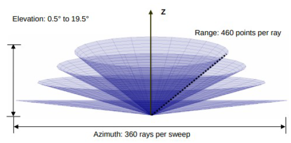
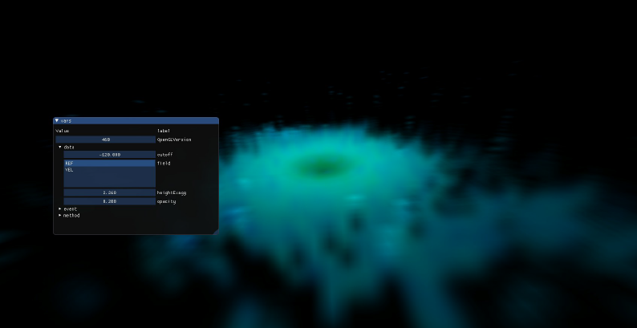

# Volumetric Rendering of NEXRAD Weather Data

Interactive NEXRAD data viewer implemented in opengl and c++.

This repository was inspired by project [Openstorm](https://www.youtube.com/watch?v=RC86Mf1O0jo&ab_channel=JordanSchlick).

My goal was to replicate a fraction of the functionality of the OpenStorm project.
- processing of the necessary data from the scan
- scan display
- switching between scans within a day
- filtering scan values
- transparency of scanlines

## Setup
1. First download `libs` folder from [FitGraphics](https://git.fit.vutbr.cz/imilet/FitGraphics) repository and put it in the corresponding location in this project folder FitGraphics. It was deleted from this project because of size restrictions in assignment.
2. create directory `data`
3. run `scrape.sh`
4. go to FitGraphics
5. run `build.sh`
6. run `./build/Fitgraphics`

You may need to install library LROSE with its dependencies.